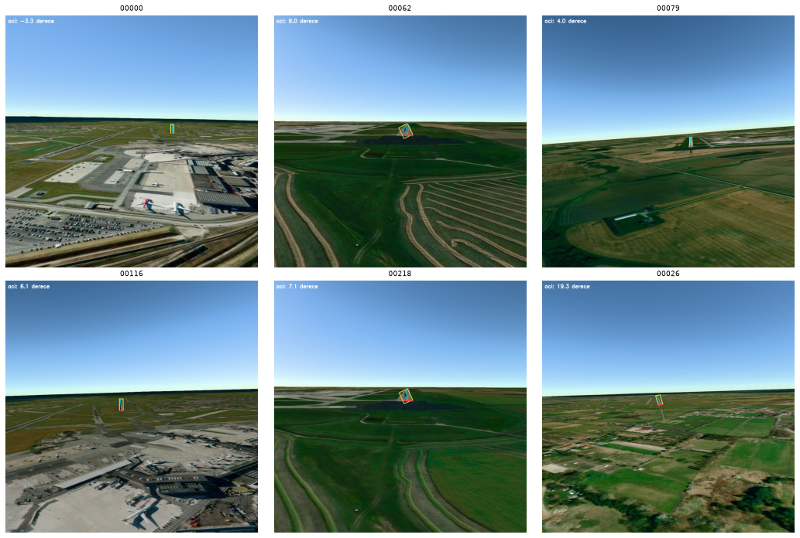
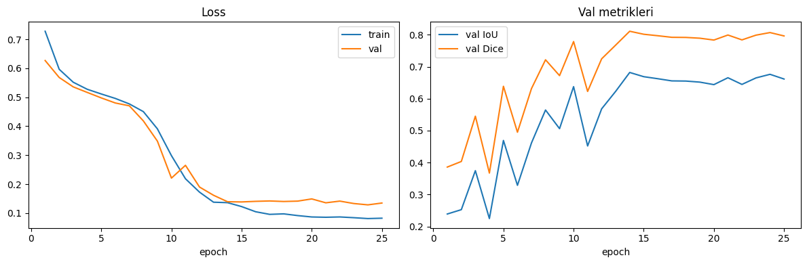
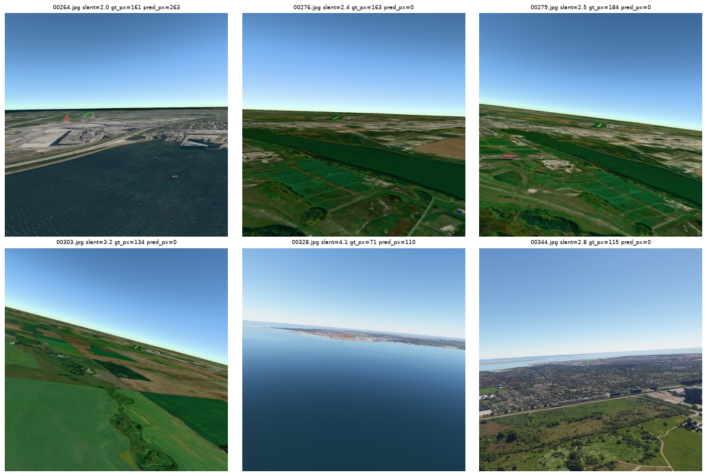

# Runway Perception System

Hava aracının **yaklaşma/iniş fazında** ön görüş kamerasından alınan görüntülerde pisti
piksel düzeyinde segmente eden ve pistin **geometrik özelliklerini** (sınırlar, merkez hattı,
yaklaşma açısı, threshold kenarı) çıkaran uçtan uca bir görsel algı sistemi.

Segmentasyon (U-Net + ResNet34) ile geometri çıkarımı (saf OpenCV) **birbirinden bağımsız**
katmanlardır: model zayıf olsa bile geometri katmanı tek başına test edilip kullanılabilir.

> Ayrıntılı mimari için [ARCHITECTURE.md](ARCHITECTURE.md), geliştirme günlüğü için
> [DEVLOG.md](DEVLOG.md), test/değerlendirme için [TESTING.md](TESTING.md).

## Veri seti

**LARD V2** (Landing Approach Runway Detection, DEEL-AI, MIT lisans) —
[HuggingFace](https://huggingface.co/datasets/DEEL-AI/LARD_V2).
Etiket, pistin **4 köşe koordinatıdır** (segmentasyon maskesi değil); maskeyi köşeleri
doldurarak üretiyoruz. Çalışmada 5 sentetik kaynaktan dengeli **800 görüntülük subset**
kullanılıyor (streaming yerine shard indirme ile). Seçim gerekçesi DEVLOG'da.

## Kurulum

```bash
python3 -m venv .venv
source .venv/bin/activate
pip install -r requirements.txt
```
> Not: Intel Mac'te torch 2.2.2 NumPy 2 ile uyumsuz; `requirements.txt` `numpy<2` ve
> `opencv-python<5` pinler.

## Çalıştırma

**1) Veri indir + böl** (lokal veya Colab):
```bash
python -m src.data.download_lard --n 800 --out data/lard
python -m src.data.split
```

**2) Eğitim** — GPU gerektiğinden Colab'da: `notebooks/train_colab.ipynb`
(Runtime → GPU → Run all). Çıkan `best.pt`'i `outputs/` altına koy.
```bash
# lokal pipeline doğrulaması (CPU, birkaç batch):
python -m src.training.train --config configs/unet_r34.yaml --epochs 1 --max-batches 2
```

**3) Değerlendirme** (metrik + feature doğrulama + failure analizi):
```bash
python -m src.training.evaluate --checkpoint outputs/best.pt
```

**4) Inference** (tekil / toplu):
```bash
python -m src.inference.predict --checkpoint outputs/best.pt --image path/img.jpg
python -m src.inference.predict --checkpoint outputs/best.pt --input-dir imgs/ --output outputs/preds
```

**5) Arayüz** (Streamlit):
```bash
streamlit run app/main.py
```

**Testler:**
```bash
pytest tests/ -v
```

## Çıkarılan pist özellikleri

1. **Pist sınırları** — `cv2.minAreaRect` ile 4 köşe.
2. **Merkez hattı** — her görüntü satırının maske orta noktalarına doğru fit (perspektife dayanıklı).
3. **Yaklaşma ekseni açısı** — merkez hattının dikeyle açısı (hizalama göstergesi; 0° = hizalı).
4. **Threshold kenarı** — pistin kameraya en yakın kenarı.

## Proje yapısı

```
src/data/       indirme, köşe→maske, split, Dataset, transforms
src/training/   model factory, loss, metrik, train, evaluate
src/inference/  predict, postprocess
src/features/   geometry (OpenCV), visualize   ← modelden bağımsız
app/            Streamlit arayüzü
configs/        hiperparametreler (unet_r34.yaml)
notebooks/      Colab eğitim notebook'u
tests/          feature extraction birim testleri
```

## Sonuçlar (test seti, 115 görüntü)

| IoU | Dice | Precision | Recall | Açı hatası (medyan) |
|-----|------|-----------|--------|---------------------|
| 0.63 | 0.77 | 0.82 | 0.74 | 9.2° |

Detaylı değerlendirme, feature doğrulama ve **sistem sınırları** için [TESTING.md](TESTING.md).

## Örnek çıktı

**Gerçek model çıktısı** (test görüntüleri, uçtan uca inference):



| Eğitim eğrileri | Failure örnekleri |
|---|---|
|  |  |

(Overlay: pist sınırları + merkez hattı + threshold + açı. Failure: GT yeşil, tahmin kırmızı.)

## Demo video

Sistemi tanıtan ~4 dk'lık demo: [`demo_video/demo.mp4`](demo_video/demo.mp4)
(problem → mimari → canlı demo → metrikler → sistem sınırları).
```
